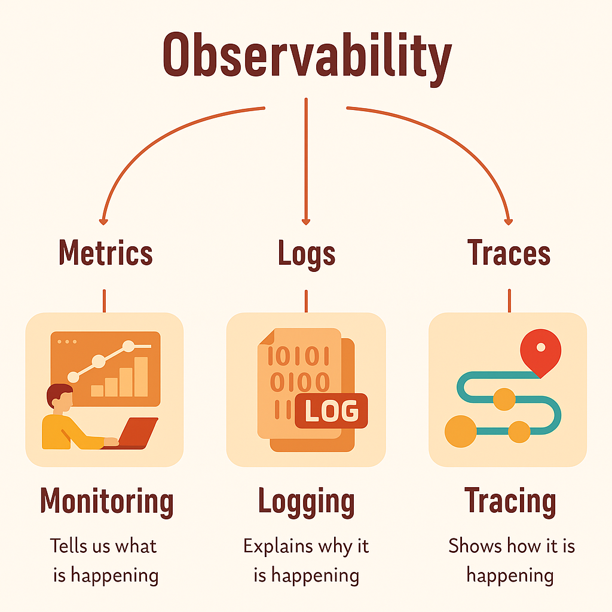

# TelemetriX

## Introduction to Observability

Observability is the ability to understand the internal state of a system by examining its outputs. It provides deep insights into system behavior, enabling teams to diagnose issues, optimize performance, and ensure reliability.

---

## The Three Pillars of Observability

Modern observability is built on three fundamental pillars:

1. **Monitoring** - Tells us what is happening
2. **Logging** - Explains why it is happening
3. **Tracing** - Shows how it is happening

> **Note:** While monitoring focuses specifically on metrics, alerts, and dashboards, true observability encompasses all three pillars working together to provide comprehensive system insights.

---

## Why Monitoring?

Monitoring helps us keep an eye on our systems to ensure they are working properly.

**Purpose:** Maintaining the health, performance, and security of IT environments.

Monitoring enables early detection of issues, ensuring that they can be addressed before causing significant downtime or data loss.

### Key Benefits

We use monitoring to:

- **Detect Problems Early** - Identify issues before they impact users
- **Measure Performance** - Track system metrics and resource utilization
- **Ensure Availability** - Maintain high uptime and reliability

---

## Why Observability?

Observability helps us understand why our systems are behaving the way they are.

It's like having a detailed map and tools to explore and diagnose issues in complex, distributed systems.

### Key Benefits

We use observability to:

- **Diagnose Issues** - Quickly identify root causes of problems
- **Understand Behavior** - Gain deep insights into system operations
- **Improve Systems** - Make data-driven decisions for optimization

---

## Getting Started

*Coming soon - This section will be updated with setup instructions and usage examples.*

---

## Contributing

Contributions are welcome! Please feel free to submit a Pull Request.

---

## License

*To be determined*
